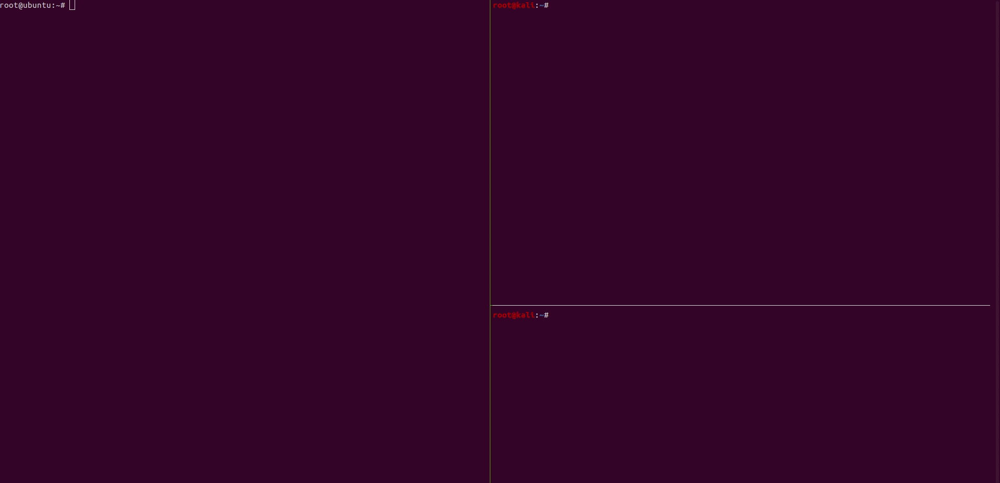

# CVE-2021-23017-PoC


```
pip install -r requirements.txt
python3 poc.py --target 172.1.16.100 --dns_server 172.1.16.1
```



This software has been created purely for the purposes of academic research and for the development of effective defensive techniques, and is not intended to be used to attack systems except where explicitly authorized. Project maintainers are not responsible or liable for misuse of the software. Use responsibly.
